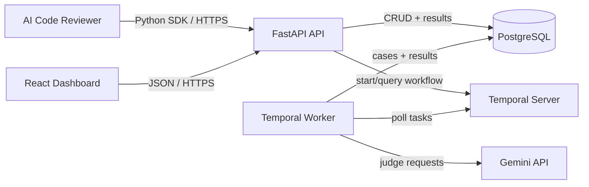

# Architecture

## Goal

TraceGrade uses a small monorepo and four product components: a FastAPI API, a Temporal worker, a Python SDK, and a React dashboard. PostgreSQL is the system of record. Temporal provides durable experiment execution.



## Repository Layout

```text
backend/    FastAPI HTTP API, authentication, persistence, and Temporal client
worker/     Temporal workflows, activities, evaluators, and retry policy
sdk/        Published Python instrumentation client
frontend/   React dashboard
docs/       Frozen architecture, schema, API, and delivery plan
infra/      Local infrastructure initialization
```

## Component Responsibilities

### FastAPI API

- Owns project and API-key lifecycle.
- Accepts idempotent trace/span ingestion.
- Owns dataset, test-case, evaluator, and experiment HTTP resources.
- Starts Temporal workflows and exposes persisted status/results.
- Computes or returns persisted comparison and regression views.
- Never executes an experiment inside an HTTP request.

### Temporal Worker

- Runs one durable workflow per experiment.
- Fans out case execution as activities with bounded concurrency.
- Runs deterministic evaluators locally.
- Calls Gemini only for configured judge evaluators.
- Applies explicit timeout and retry policies.
- Persists case-level progress and terminal results idempotently.

### Python SDK

- Provides a small synchronous-first API for traces and spans.
- Batches ingestion and retries transient failures with limits.
- Never contains evaluation or model-routing logic.
- Can be added to the AI Code Reviewer with minimal application changes.

### Dashboard

- Uses the public HTTP API; it does not access PostgreSQL directly.
- Covers projects, traces, datasets, experiments, results, comparisons, and regressions.
- Does not introduce a separate product workflow.

## Data and Control Flow

### Trace ingestion

1. An instrumented application creates a trace and nested spans through the SDK.
2. The SDK sends a project API key and stable client-generated IDs.
3. The API authenticates the key, validates payload limits, and upserts by project and external ID.
4. The API returns accepted resource IDs; retries cannot create duplicates.

### Experiment execution

1. The API snapshots an experiment's dataset cases and evaluator configuration.
2. The API starts a Temporal workflow using the experiment UUID as the workflow ID.
3. Activities execute each case, collect model metadata, and run evaluators.
4. Activities persist idempotent case results; the workflow records terminal status.
5. API and dashboard clients read progress and aggregate results from PostgreSQL.

### Comparison and regression detection

1. A user selects completed baseline and candidate experiments from the same project.
2. TraceGrade aligns aggregate metrics and, where possible, matching test cases.
3. It calculates absolute and relative deltas for quality, latency, and estimated cost.
4. Configured thresholds produce persisted regression records shown in the API and dashboard.

## Security Boundary

- `X-TraceGrade-Admin-Key` protects project and API-key administration for the single-owner installation.
- `Authorization: Bearer <project-api-key>` authorizes project-scoped product APIs.
- Only API-key prefixes are displayed; secrets are stored as hashes and shown once at creation.
- The browser never receives database, Temporal, Gemini, or raw admin credentials in a production deployment.
- Secrets are supplied through environment variables and are absent from source control.

## Reliability Rules

- HTTP ingestion is idempotent by stable external IDs.
- Experiment writes are idempotent by experiment and test-case IDs.
- Temporal owns execution retries; HTTP clients do not duplicate workflow starts.
- Retries are limited to transient failures. Validation and evaluator configuration failures are terminal.
- Timeouts exist for outbound model calls and activities.
- Partial progress remains queryable after process restarts.

## Deployment Shape

The same container images used locally are deployed publicly: API, worker, dashboard, PostgreSQL, and Temporal. v1 targets one small installation. Horizontal scaling, orchestration platforms, and enterprise operations are intentionally excluded.
